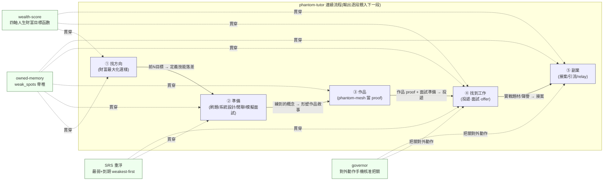

> ARCHIVED 2026-06-19 — 內容已併入 docs/phantom-tutor.md;此為歷史版本。

# phantom-tutor — 端到端流程 / End-to-End Flow（單一 SSOT 流程文件）

> 日期:2026-06-19 · 狀態:流程整合(SSOT)
> 本檔是 phantom-tutor 的**單一連續流程**文件,把先前散落的設計/OSS/營利分析
> **整合成一條從「準備 → 作品 → 找到工作 → 副業」的旅程**,而非分開的模組。
> 細節仍由各分檔承載,本檔以「引用 + 摘要進對應階段」收束,不重貼大段:
> [設計規格](2026-06-18-phantom-tutor-design.md)、[ROADMAP](../ROADMAP.md)(狀態 SSOT)、
> [OSS 生態與方向](OSS-LANDSCAPE-AND-DIRECTION.md)(求職 copilot 升級 + wealth-score)、
> [營利分析](MONETIZATION-ANALYSIS.md)(副業階段)。
> **本檔不含任何個人資料(PII)**:無具體薪資/公司名/個人求職切片。

---

## ① 一句話

> **phantom-tutor = 一條從「準備 → 作品 → 找到工作 → 副業」的連續流程,
> 由 `weak_spots` owned-memory + SRS + 財富評分(wealth-score)+ governor 串起來;
> 不是分開的模組,是同一條會複利的管線。**

每一階段的**輸出餵進下一階段**:財富最大化的方向選樣 → 定義你的技能落差(`weak_spots`)→
驅動每日準備 → 把準備內容形塑成作品 proof → 投遞·面試·拿 offer → 把實戰題材轉成副業。
貫穿全程的不是某個 mode,而是四條**連接物**:owned-memory(記住你哪裡弱)、
SRS(把最該補的弱點隔天重浮)、wealth-score(每一步都對齊同一個人生財富目標函數)、
governor(任何對外動作走手機核准把關)。

---

## ② 端到端流程圖(一張 Mermaid)

**怎麼讀這張圖**:橫向五個方塊是同一條流程的五個階段,實線箭頭標的是
「上一段的**輸出**如何餵成下一段的**輸入**」;下方四個綠塊是**貫穿全程的連接物**,
虛線標出它們各自參與哪些階段——這四條 thread 才是「一條流程」而非「五份清單」的關鍵。

---

## ③ 逐階段表(每階段的輸出 = 下一階段的輸入)

| 階段 | 目標 | phantom-tutor 做什麼(對應 mode/feature) | 連接物(weak_spots / SRS / wealth-score / governor 怎麼參與) | 用到哪些 OSS(候選) | 與 phantom-mesh 生態整合 | **輸出 → 餵進下一階段** |
|---|---|---|---|---|---|---|
| **① 找方向** | 從一堆目標缺裡,排出「對人生財富最該投的前 N 個」,而非投越多越好 | `tutor jobs`(新):ingest 既有 scored-jobs CSV → 算 demand frequency → `wealth-score` 重排(純讀既有資料,零爬取/零對外/零 ToS) | **wealth-score** 是本階段主角:四軸(既有槓桿 × 抗 AI 取代 × 薪資天花板 × 契合命中)疊在既有關鍵字命中分**之上**,故意讓「作品槓桿+耐久方向」壓過純薪資 | levels.fyi 僅人工參考薪資 band(無開源授權,**勿爬**);wealth-score 為自建薄評分函式 | **ai-feed** 餵目標角色的市場訊號(哪類平台/治理職缺在長、JD 關鍵字在變什麼) | **前 N 個目標角色叢集**+ 每叢集「JD 要求 vs 我」的落差 → 成為 ② 的 `weak_spots` 種子 |
| **② 準備** | 把準備變成「有 owned-memory、會複利」的每日 loop;四模式對齊 ① 排出的目標角色 | 既有 4 模式 + 每日驅動:`tutor quiz`(知識)、`tutor code`(沙箱單元測試批改)、`tutor design`(rubric+LLM 評分)、`tutor interview`(模擬面試官,多輪、讀 weak_spots);`tutor today / weak-spots / stats` | **weak_spots** 把每次練習(對/錯/分數)寫進脊椎;**SRS** 依「間隔重複+弱點優先」把最該補的隔天重浮、weakest-first;練什麼由 ① 的 wealth-score 目標角色驅動,不憑感覺 | **py-fsrs**(MIT)取代手刻 SM-2-lite(磨利再現護城河);**system-design-primer / interactive-coding-challenges**(僅 reference 結構/題型,CC 授權須署名勿整批 vendor);**RAGAS / Interviewer**(reference judge 評分量表/模擬 UX) | **core 多供應商 LLM** 當面試官/批改器(測試一律 stub,hermetic);**core owned-memory**(Phase-3 把 weak_spots 從本地 JSON 換成加密、跨裝置、廠商看不到的真記憶) | **練熟的概念/系統設計/防守敘事** → 形塑 ③ 作品要主打的差異化點(governor + flight-recorder) |
| **③ 作品** | 把 phantom-mesh 收斂成「30 秒看得懂價值」的 proof-of-work,讓「年資淺」被作品蓋過 | `tutor design`/`tutor interview` 雙倍用途:把「agent runtime governor」「multi-LLM router」做成 design seed——**練 system design 同時加深作品敘事**;`tutor interview` 讀你的 weak_spots + 你的作品來出防守題 | **weak_spots** 記住作品敘事裡你會被問倒的點,SRS 回沖;**wealth-score** 的 W1(既有槓桿)+ W2(抗 AI 取代)兩軸正是作品該放大的維度 | 作品本體不依賴外部 OSS(自有護城河);reference 級僅止於評分量表構想 | **作品本身就是 phantom-mesh 生態的「會走路的 demo」**:在單一垂直上把 owned-memory(②)、多供應商 LLM、governor(④手機核准)全用上 | **作品 proof + 收斂定位 + 90 秒治理 demo** → 成為 ④ 投遞時履歷的決定性武器 |
| **④ 找到工作** | 端到端陪跑:投遞 → 追蹤 → 面試 → offer/談薪,全部對齊同一個財富目標函數 | `tutor interview --focus/--cluster` 對齊目標叢集出 mock;`tutor today` 面試後複盤把答崩的題沉成 weak_spot 隔天重浮;`tutor jobs --for-company` 只排該公司 JD 命中的弱點 | **weak_spots+SRS** 做面試循環的複盤引擎;**wealth-score** 在 offer 階段也用——base 略低但更靠平台/治理(W1/W2 高、3 年後 band 與耐久更好)的工作可能贏過高 base 應用職;**governor** = 任何**對外動作**(送申請/寄信)走 PreToolUse gate → **手機核准才執行**(把自動化做得合規的唯一正確方式) | **JobSpy**(MIT,海外板)可 wrap,但**必須包在 governor 後、限速、僅個人用**(爬取有 ToS 風險);**Resume-Matcher**(Apache-2.0)reference ATS/關鍵字 gap 思路;🚩 **AIHawk(AGPL,已 archived)= 不盲目自動投遞**,僅 reference「LLM 依 JD 客製履歷段落」構想 | **companion**(jobseek-aging)做投遞後時效追蹤(N 天沒回 → follow-up、面試後 thank-you);**core governor + 手機核准**(apex-④)把關每個對外動作 | **面試實戰題材 + 聲譽 + 一個跑著的作品** → 成為 ⑤ 副業的接案題材與信任憑證 |
| **⑤ 副業** | **同一條流程的尾巴**(不是另一個產品):把作品/實戰轉成接案/引流,(可選)綁 mesh relay | 作品(phantom-tutor 本身就是「我把 AI mesh 編成 owned-memory 求職教練」的 demo)當引流物;無新增使用者付費核心功能 | **governor** 仍把關所有對外動作(貼文/寄信/接案溝通自動化都走人控核准);**wealth-score** 的「契合/黏著」軸延伸到「接哪些案能長期複利」 | reference 級延續 ④(履歷/match 工具);副業本身不引入新重依賴 | **(可選)綁 phantom-mesh 那一個 zero-knowledge relay**:長 session 跨裝置、加密弱點/漏斗備份是 relay 的「應用情境之一」,**不另立 SaaS/帳號**;核心永久免費離線可用 | (流程閉環)副業的市場回饋與題材 → 反哺 ①③ 的方向與作品迭代 |

---

## ④ 副業 = 同一條流程的尾巴(不是另一個產品)

副業**不是**在 phantom-tutor 之外另起的產品線,而是 ①→④ 這條流程的**自然延伸**:
你在 ③ 累積的作品 + 在 ④ 累積的實戰與聲譽,直接成為接案/引流的題材與信任憑證。
引用 [`MONETIZATION-ANALYSIS.md`](MONETIZATION-ANALYSIS.md) 的階段 0–3,但放進這條 flow 的脈絡:

| 營利階段(引用 MONETIZATION ④) | 在本流程裡的位置 | 連接物 |
|---|---|---|
| **階段 0 — 個人工具優先(唯一硬目標)** | = 本流程 ①②③④ 本身做透,**零營利動作**。產品好不好用是後面一切前提。 | weak_spots / SRS / wealth-score / governor 全在此階段被 dogfood |
| **階段 1 — 作品 → 接案/顧問引流(E,最務實零風險)** | = ⑤ 的主力。把 phantom-tutor 當「會走路的 demo」展示,引流到接案/顧問/職涯。**不增加任何產品功能、不收使用者錢、不違反任何 apex 條款。** | governor 仍把關對外引流動作 |
| **階段 2 — 自願終身 supporter(C,Immich 式零功能閘)** | = ⑤ 的可選前置現金流。*若*公開且有社群,掛零功能差異的純贊助。轉換率現實 <1%。 | 與 phantom-mesh Lever A 同框,同一 merchant-of-record |
| **階段 3 — 綁 phantom-mesh relay(D,唯一「產品型」收入,不另立 SaaS)** | = ⑤ 的條件式尾段。*若且唯若* mesh 的 zero-knowledge relay 已上線,把 tutor 的長 session/手機核准/加密備份做成 relay 的應用情境之一。 | relay 只搬讀不懂的密文;核心永久免費離線可用 |

**營利優先序(全在「個人工具優先」前提下)**:**E(作品→接案)> C(終身 supporter)> D(綁 mesh relay)**;
明確否決會 paywall 核心或加帳號的選項(SaaS/B2B);**永不為 tutor 單獨蓋 SaaS、帳號或付費閘。**

---

## ⑤ 分期落地 + over-build / 倫理紅線

### 這條 flow 先做哪一段(對齊 ROADMAP Phase-3 owned-memory 旗艦 + dev 開發模型)

便宜高價值先做,每段「只在前一段被真實使用證明後才推進」:

1. **① wealth-score(現在,最便宜最高價值)**:純讀既有 scored-jobs CSV + 一個四軸薄評分函式,
   零爬取/零對外,立刻把目標排成「前 N 個該主投的」。
2. **②→① 回路:gap 播種**:把「目標角色要求 vs 我的技能」落差寫進 `weak_spots`,
   SRS 回沖最該補的缺口,讓 `tutor today` 第一天就 grounded。
3. **②③ seed 對齊**:把 system-design / behavioral / 必答概念寫進內容庫,練的內容 100% 對齊主方向。
4. **Phase-3 旗艦(護城河)**:把 `weak_spots` 從本地 JSON 換到 **phantom core owned-memory**
   (加密、跨裝置、廠商看不到)——這是頭條的 apex-② 工作,**ROADMAP Planned-next 尚未實作**。
5. **④ 受治理的對外(最後)**:`govern` 包長 session + JobSpy 海外板限速爬取 + companion 投遞追蹤,
   **全部經 governor + 手機核准**。**先把前幾步用熟、確認落差再做這步。**

### over-build 警示(別過早深化)

- 🚩 **在真實每日使用證明落差前,別深化模式評分。** 四模式*刻意*單薄;FSRS + 真 owned-memory 後端
  今天比更豐富的評分量表更有價值。
- 🚩 **wealth-score 別過度工程。** 第一版就是「既有命中分 + 四軸加權」的薄函式;先用真實求職證明它有用,再談 LLM 細化。
- 🚩 **爬取要克制。** JobSpy 海外板 rate-limit 真實存在;低頻、個人用、治理化;別變成爬蟲農場。
- 🚩 **別重造求職板/履歷編輯器。** Resume-Matcher / Reactive-Resume 已成熟;reference 或自架,別內嵌重寫。
- 🚩 **授權衛生。** Anki / OpenResume / AIHawk = **AGPL**(地雷);coding-interview-university = **CC-BY-SA**(傳染);
  借構想/結構,切勿把文字/程式碼 vendor 進出貨樹。優先 MIT/BSD/Apache(py-fsrs、JobSpy、Resume-Matcher)。

### 倫理紅線(❌ 永不做)

- 🚩🚩 **不做即時隱形面試外掛(cheating-side)。** Final Round AI / LockedIn AI / Cluely 一類賣的是
  「對螢幕分享隱形、面試當下餵答案」的工具,引發面試誠信危機、踩平台 ToS、誤導真實能力,
  且與 phantom-tutor「讓你**真的變強**、能力複利」的產品目的**正面對立**。
  → **裁決:phantom-tutor 永遠站在 PREP-side(賽前練到強),絕不站在 cheating-side(賽中餵答案)。**
  全部五個階段都是**賽前**準備與**賽後**轉化;不做任何「面試進行中即時隱形提示」功能。
- 🚩 **對外動作一律人控 + governor 核准。** 不做 AIHawk 式盲目自動大量投遞(踩 ToS、品質低、傷招募方信任)。
- 🚩 **不 paywall 核心、不對隱私本身收費。** 「資料不出本機」是賣點不是收費點。

---

## Sources(整合自分檔,不重貼)

- 設計/架構/四模式/每日 loop — [`2026-06-18-phantom-tutor-design.md`](2026-06-18-phantom-tutor-design.md)
- 狀態 SSOT / Shipped / Planned-next — [`../ROADMAP.md`](../ROADMAP.md)
- 求職 copilot 升級 / wealth-score 四軸 / OSS adopt-wrap-reference-build 裁決 — [`OSS-LANDSCAPE-AND-DIRECTION.md`](OSS-LANDSCAPE-AND-DIRECTION.md)
- 副業階段 0–3 / apex 對齊 / 倫理紅線 — [`MONETIZATION-ANALYSIS.md`](MONETIZATION-ANALYSIS.md)
- phantom-mesh 商業化(Nabu-Casa)— `../../phantom-mesh-private/docs/COMMERCIALIZATION-STRATEGY.md`
