> ARCHIVED 2026-06-19 — 內容已併入 docs/phantom-tutor.md;此為歷史版本。

# phantom-tutor 路線圖（繁體中文 · 視覺化）

> 📅 日期戳：**2026-06-19** · 英文 SSOT 狀態以 [`ROADMAP.md`](ROADMAP.md) 為準（衝突時看英文）。
> 設計依據：[docs/2026-06-18-phantom-tutor-design.md](docs/2026-06-18-phantom-tutor-design.md)。
> 選型依據：[docs/OSS-LANDSCAPE-AND-DIRECTION.md](docs/OSS-LANDSCAPE-AND-DIRECTION.md)。

## ① 一行定位 + 護城河

🎯 **一個跑在 phantom-mesh core 上、我天天用的個人學習助手——AI 工程師面試準備是旗艦用例。**

🏰 **護城河（四件事疊起來）**：
- 🧠 **weak_spots owned-memory 脊椎** — 弱點存進**你自己的加密 owned-memory**，每次 session recall 回來、廠商看不到（= apex ②「越用越懂你」直接落在學習上）。
- 🔁 **SRS 間隔重複** — 依「間隔重複 + 弱點優先」把該複習/最弱的點端回來考。
- 🛡️ **受治理（governor）** — 長 session 跑在你的硬煞車底下（= apex ④ 安全無人值守的差異化）。
- 🌐 **phantom-mesh 整合** — 多供應商 LLM mesh 當面試官/批改器；重批改可派到 GPU 節點。

> 不是題庫 SaaS、不做帳號/雲端同步/付費、不爬題庫（seed + 自建，避版權）。

---

## ② 狀態流（Mermaid）

```mermaid
flowchart LR
    subgraph S["✅ 已出貨（Phase-1 + Phase-2,已併入 master）"]
        A1["🧠 weak_spots 脊椎<br/>(本地 JSON,介面可換)"]
        A2["🔁 SRS(手刻 SM-2-lite)<br/>built-out 但演算法簡單"]
        A3["🎯 4 模式(CLI 可達+e2e)<br/>quiz/code/design/interview<br/>多數刻意薄"]
        A4["📦 內容層 seed banks<br/>+ scenarios.md 攻略"]
        A5["📅 每日迴圈<br/>today/weak-spots/stats"]
    end
    subgraph P1["🚧 階段一(便宜高值,先做)"]
        B1["⭐ FSRS 換手刻 SM-2<br/>(adopt py-fsrs, MIT)"]
    end
    subgraph P2["📅 階段二(護城河旗艦)"]
        C1["⭐ 真 owned-memory backend<br/>memory.py 接 phantom core"]
        C2["🛡️ governor / mesh 整合<br/>長 session 受治理"]
    end
    subgraph P3["🔭 階段三(用過再深化)"]
        D1["📚 模式深化<br/>評分品質/追問深度/提示分級"]
        D2["📊 進度視覺化"]
    end
    S --> P1 --> P2 --> P3
```

---

## ③ 分期表

> 開發模型：**單人多機**（編排節點(Win)編排 · Mac 節點 · Win 節點跑 Rust · Android worker）；
> **寫**=codex/claude，**審**≥2 個 distinct-AI，**governor + 雙閘 → 手機**。
> 排序：💰 便宜高值先 → 🏰 護城河先 → 🙋 需操作者決策後。

| 階段 | 🎯 目標 | 具體項（grounded） | 🖥️ 在哪台機 + 哪 AI | ⚠️ 風險前置 |
|---|---|---|---|---|
| 🚧 **一** (💰便宜高值) | 把資源排程從手刻升級到業界標準 | • ⭐ `srs.py` 手刻 SM-2-lite → **adopt py-fsrs(MIT)**,走既有 `next_interval_days`/`is_due` 接縫,additive | 編排節點(Win);codex 寫(單檔機械改)·opencode/agy 審 | py-fsrs 是新依賴 → 先確認 pin 版本、保留 stub 測試 hermetic;swap 必須 byte-compatible 預設行為 |
| 📅 **二** (🏰護城河旗艦) | 弱點記憶上鏈,長 session 受治理 | • ⭐ `memory.py` 後端從本地 JSON → **phantom core owned-memory**(加密/跨裝置/廠商看不到) • 🛡️ 長 interview/grading session 包進 `phantom govern`;重批改 `phantom dispatch` 到 GPU 節點 | 編排節點(Win)接 core;Rust 整合驗證走 Win 節點;claude 寫接線 · ≥2 AI 審 | 🙋 **需操作者決策**:owned-memory schema/key 對接點;**絕不寫真 `~/.phantom-mesh`**,測試一律 tmp + stub |
| 🔭 **三** (🙋用過再深化) | 真用之後才補的深度 | • 評分品質(LLM 自由作答 / RAGAS 式 judge rubric 參考) • coding 提示分級 + 複雜度回饋;design 參考架構庫;interview 追問深度/語氣 • 📊 進度視覺化 | 編排節點(Win);模式各自 codex/claude 寫 · ≥2 AI 審;Android worker 可跑批改 | 🚩 **別在真用證明缺口前深化**(見 ④);模式現在薄是**刻意的** |

---

## ④ 刻意不做 / over-build 風險

| 🚫 別做 | 為什麼 | 該怎麼做 |
|---|---|---|
| 🚩 **爬題庫網站**(LeetCode/HackerRank…) | 版權 + ToS 風險 | seed + **自建**題庫(已鎖定政策) |
| 🚩 **在真用前深化模式評分** | 模式現在薄是**刻意的**;FSRS + 真 owned-memory 價值更高 | 先做護城河,模式深度等真日用暴露缺口再補 |
| 🚩 **vendor AGPL / CC-BY-SA 文字進 shipped 內容** | Anki/anki-sm-2 = AGPL;coding-interview-university = CC-BY-SA(share-alike 病毒式) | 只**參考結構/點子**;選 **MIT/BSD/Apache**(py-fsrs/fsrs-rs/RAGAS) |
| 🚩 **吃重量級 eval 平台依賴**(RAGAS-as-lib/langchain) | 對單人 tutor 是 over-build,破壞 hermetic/小巧 | 借 **rubric 寫法**,runtime 保持小且 stub-able |
| 🚩 **走向題庫 SaaS / 帳號 / 雲端同步 / 付費** | 設計 spec §10 明確排除;偏離 niche | 守住「owned-memory + 受治理 + mesh 整合」的**個人**迴圈 |
| 🚩 **compose ai-feed / training,或改 phantom core/apex** | 平行衛星只共用 core;downstream 永不塑造產品(apex) | 只站在 **core 三樣**(LLM/owned-memory/governor)上 |

> **選型候選**(細節見 [OSS-LANDSCAPE-AND-DIRECTION.md](docs/OSS-LANDSCAPE-AND-DIRECTION.md)):
> ⭐ adopt **py-fsrs(MIT)** 換手刻 SM-2 · reference **system-design-primer / RAGAS / Interviewer** ·
> build/own **runner.py · scenarios.md · weak_spots 模型**。
