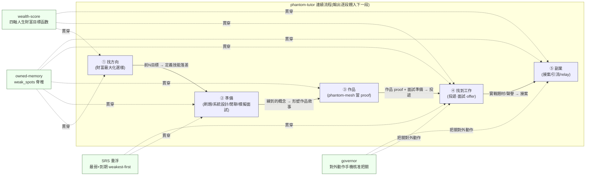

# phantom-tutor — 唯一主文件

> 本檔為 phantom-tutor 的**唯一主文件**;個人化求職資料在 gitignored 的 `personalized/`(**不在此**,也不會進公開文件);舊版見 `docs/_archive/`。
> 對應狀態:`master` @ `8e08fca` — Phase-1 + Phase-2 皆已併入,一個真實的 `tutor` CLI 可端到端跑、28 passing tests、ruff clean。每個「已出貨」項都對應 `master` 上的真實 commit;`Planned-next` 以下才是未實作的方向。
> 英文狀態 SSOT 細節以 `docs/_archive/ROADMAP.md`(歷史快照)為起點,當前以本檔為準。

## 目錄
- [定位與護城河](#定位與護城河)
- [快速上手](#快速上手)
- [端到端流程](#端到端流程)
- [狀態與視覺路線圖](#狀態與視覺路線圖)
- [開源生態與方向](#開源生態與方向)
- [營利](#營利)
- [刻意不做 / over-build / 倫理紅線](#刻意不做--over-build--倫理紅線)

---

## 定位與護城河

**phantom-tutor 是一條跑在 phantom-mesh core 上的「求職 copilot」——從「準備 → 作品 → 找到工作 → 副業」的連續流程,而非分開的模組。** 以 Python 撰寫,封裝為 `phantom-tutor`,附帶 `tutor` CLI。它與 `phantom-finance` / `phantom-quant` / `phantom-companion` 同位階,**直接長在 phantom-mesh core 上**,不掛載在其他衛星。

**一句話定位:** 一個我**天天用**的求職 copilot——AI 工程師面試準備是旗艦用例,但整條漏斗(找方向 → 準備 → 作品 → 投遞·面試·offer → 副業)都對齊**同一個人生財富目標函數**。同時是面試現場拿得出手的**作品**(證明能把 owned-memory + 多供應商 LLM + 治理組成一個解決真實問題的 app)。

**護城河 = 四件事疊起來,串起整條漏斗**(⚠️ 其中只有 `weak_spots` 脊椎與 SRS **已出貨**;加密 owned-memory backend、wealth-score、governor 整合是**規劃中的方向**,尚未實作——見〈狀態與視覺路線圖〉):
- 🧠 **`weak_spots` owned-memory 脊椎** — 弱點/技能落差存進你自己的 owned-memory,每次 session recall 回來(= apex ②「越用越懂你」直接落在求職上)。這是頭條 moat。**現況**:`memory.py` 為本地 JSON、介面可換;Phase-2 才接 phantom core 真記憶(加密/跨裝置/廠商看不到)。
- 🔁 **SRS 間隔重複**(已出貨) — 依「間隔重複 + 弱點優先」把最該補的缺口隔天 weakest-first 重浮(目前手刻 SM-2-lite,規劃換 py-fsrs)。
- 💰 **wealth-score(四軸人生財富目標函數)**(規劃中) — 不是「下一份薪水最大」,而是**既有資產槓桿 × 抗 AI 取代/耐久性 × 薪資天花板 × 契合/黏著**;疊在既有關鍵字命中分**之上**,讓每一步都對齊同一個目標函數。這是**沒有任何 SaaS 在做**的那一層,**尚未實作**。
- 🛡️ **governor + 手機核准**(規劃中) — 任何**對外動作**(送申請、寄信、貼文)走 PreToolUse gate → **手機核准才執行**(= apex ④ 安全無人值守;把自動化做得合規的唯一正確方式)。core 能力已存在於 phantom-mesh,tutor 的整合屬 Planned-next。

護城河本質 = **本地優先 + 你自己這場求職的 owned-memory + wealth-objective 評分**,加密、廠商看不到。JobScan / LinkedIn / Teal 之流握的是「別人的資料 + 雲端」;copilot 握的是「**你的**漏斗 + 你的弱點 + 你的目標函數」。

> 不是題庫 SaaS、不做帳號/雲端同步/付費、不爬題庫(seed + 自建,避版權)、**不做即時隱形面試外掛**(倫理紅線,見末節)。

---

## 快速上手

phantom-tutor 預設 **hermetic、LLM-stubbed**(`PHANTOM_TUTOR_STUB_LLM=1` 走確定性 stub,零網路/金鑰),測試一律 tmp `PHANTOM_TUTOR_HOME`、**絕不寫真 `~/.phantom-mesh`**。

```bash
tutor quiz --id k-softmax --answer "subtract max for numerical stability"
tutor code --id c-add --solution my_add.py
tutor design --id d-rag --answer my_answer.txt
tutor interview --focus LLM --answer "RAG retrieves and grounds the answer"
tutor today          # SRS 到期主題,最弱優先
tutor weak-spots     # 你最弱的主題排行
tutor stats          # 進度
```

各模式把每次練習(對/錯/分數)寫進 `weak_spots` 脊椎(`$PHANTOM_TUTOR_HOME/weak_spots.json`);SRS 透過 `tutor today` 把弱/到期的端回來。LLM 走 `phantom exec`(設 `PHANTOM_TUTOR_STUB_LLM=1` 走離線/開發 stub)。

| 模式 | 做什麼 | 評分 |
|---|---|---|
| `tutor quiz` | 知識問答(AI/ML 概念:transformer/RAG/embedding/eval/agent…) | 關鍵字評分(預設);`--llm` 走 LLM 評分 |
| `tutor code` | DSA / ML-coding,自帶參考單元測試 | 自有沙箱 subprocess runner,pass-rate |
| `tutor design` | 系統設計題 + rubric | core LLM 依 rubric 評分(測試 stub) |
| `tutor interview` | 模擬面試官,讀你的 weak_spots | LLM;`--turns N` 多輪(預設單輪) |

---

## 端到端流程

> 整合自 `docs/_archive/END-TO-END-FLOW.md`。phantom-tutor 把先前散落的設計/OSS/營利分析**整合成一條從「準備 → 作品 → 找到工作 → 副業」的旅程**,而非分開的模組。
> **本節不含任何個人資料(PII)**:無具體薪資/公司名/個人求職切片。

**一句話:** phantom-tutor = 一條從「準備 → 作品 → 找到工作 → 副業」的連續流程,由 `weak_spots` owned-memory + SRS + wealth-score + governor 串起來;不是分開的模組,是同一條會複利的管線。每一階段的**輸出餵進下一階段**。

### 端到端流程圖(一張 Mermaid)



**怎麼讀這張圖**:橫向五個方塊是同一條流程的五個階段,實線箭頭標的是「上一段的**輸出**如何餵成下一段的**輸入**」;下方四個綠塊是**貫穿全程的連接物**——這四條 thread 才是「一條流程」而非「五份清單」的關鍵。

### 逐階段表(每階段的輸出 = 下一階段的輸入)

| 階段 | 目標 | phantom-tutor 做什麼 | 連接物(weak_spots / SRS / wealth-score / governor) | OSS(候選) | phantom-mesh 生態整合 | **輸出 → 下一階段** |
|---|---|---|---|---|---|---|
| **① 找方向** | 從一堆目標缺裡排出「對人生財富最該投的前 N 個」,而非投越多越好 | `tutor jobs`(新):讀既有 scored-jobs CSV → 算 demand frequency → `wealth-score` 重排(純讀既有資料,零爬取/零對外/零 ToS) | **wealth-score** 是主角:四軸(既有槓桿 × 抗 AI 取代 × 薪資天花板 × 契合)疊在既有命中分**之上**,讓作品槓桿+耐久方向壓過純薪資 | levels.fyi 僅人工參考薪資 band(無開源授權,**勿爬**) | **ai-feed** 餵目標角色市場訊號(哪類平台/治理職缺在長、JD 關鍵字在變什麼) | **前 N 個目標角色叢集** + 每叢集「JD 要求 vs 我」落差 → ② 的 `weak_spots` 種子 |
| **② 準備** | 把準備變成「有 owned-memory、會複利」的每日 loop;四模式對齊 ① 排出的角色 | 既有 4 模式 + `tutor today / weak-spots / stats` | **weak_spots** 寫進每次練習;**SRS** 把最該補的隔天 weakest-first 重浮;練什麼由 ① 的 wealth-score 目標角色驅動 | **py-fsrs**(MIT)換手刻 SM-2-lite;**system-design-primer / interactive-coding-challenges**(僅 reference 結構/題型);**RAGAS / Interviewer**(reference judge 評分量表/模擬 UX) | **core 多供應商 LLM** 當面試官/批改器(測試 stub);Phase-3 把 weak_spots 從本地 JSON 換成 **core owned-memory** | **練熟的概念/系統設計/防守敘事** → 形塑 ③ 作品差異化點 |
| **③ 作品** | 把 phantom-mesh 收斂成「30 秒看得懂價值」的 proof-of-work,讓「年資淺」被作品蓋過 | `tutor design`/`tutor interview` 雙倍用途:把「agent runtime governor」「multi-LLM router」做成 design seed,練 system design 同時加深作品敘事 | **weak_spots** 記住作品敘事裡會被問倒的點,SRS 回沖;**wealth-score** 的既有槓桿 + 抗 AI 取代兩軸正是作品該放大的維度 | 作品本體不依賴外部 OSS(自有護城河);reference 級僅止於評分量表構想 | 作品本身就是 phantom-mesh 生態的「會走路的 demo」:在單一垂直上把 owned-memory(②)、多供應商 LLM、governor(④)全用上 | **作品 proof + 收斂定位 + 90 秒治理 demo** → ④ 投遞的決定性武器 |
| **④ 找到工作** | 端到端陪跑:投遞 → 追蹤 → 面試 → offer/談薪,全部對齊同一個財富目標函數 | `tutor interview --focus/--cluster` 對齊目標叢集出 mock;`tutor today` 面試後複盤把答崩的題沉成 weak_spot;`tutor jobs --for-company` 只排該公司 JD 命中的弱點 | **weak_spots+SRS** 做面試循環複盤引擎;**wealth-score** 在 offer 階段也用(靠平台/治理的工作可能贏過高 base 應用職);**governor** = 任何對外動作走 PreToolUse gate → **手機核准才執行** | **JobSpy**(MIT,海外板)可 wrap,但**必須包在 governor 後、限速、僅個人用**;**Resume-Matcher**(Apache-2.0)reference ATS/關鍵字 gap;🚩 **AIHawk(AGPL,已 archived)= 不盲目自動投遞**,僅 reference 構想 | **companion**(jobseek-aging)做投遞後時效追蹤;**core governor + 手機核准**(apex-④)把關每個對外動作 | **面試實戰題材 + 聲譽 + 一個跑著的作品** → ⑤ 副業的接案題材與信任憑證 |
| **⑤ 副業** | **同一條流程的尾巴**(不是另一個產品):把作品/實戰轉成接案/引流,(可選)綁 mesh relay | 作品本身當引流物(「我把 AI mesh 編成 owned-memory 求職教練」的 demo);無新增使用者付費核心功能 | **governor** 仍把關所有對外動作;**wealth-score** 的「契合/黏著」軸延伸到「接哪些案能長期複利」 | reference 級延續 ④;副業本身不引入新重依賴 | **(可選)綁 phantom-mesh 那一個 zero-knowledge relay**:長 session 跨裝置、加密備份是 relay 的應用情境之一,**不另立 SaaS/帳號**;核心永久免費離線可用 | (流程閉環)副業市場回饋 → 反哺 ①③ 的方向與作品迭代 |

**四線貫穿:** 貫穿全程的不是某個 mode,而是四條**連接物**——owned-memory(記住你哪裡弱)、SRS(把最該補的弱點隔天重浮)、wealth-score(每一步對齊同一個目標函數)、governor(任何對外動作走手機核准把關)。

---

## 狀態與視覺路線圖

> 排序原則:① **便宜高值優先** ② **護城河優先於廣度** ③ 需操作者決策/真錢/對外動作的**排後並標明** ④ 明列**刻意不做**。
> 每個「已出貨」項對應 `master` 上的真實 commit;階段一/二/三的**具體選型**(py-fsrs / JobSpy / Resume-Matcher)屬下方〈開源生態與方向〉的**建議路線**(候選方向),非已鎖定承諾。
> 開發模型:**單人多機**(z13 編排 · M5/M1 Mac · acer/ayaneo 跑 Rust · Android worker);**寫**=codex/claude,**審**≥2 個 distinct-AI,**governor + 雙閘 → 手機**。

### 狀態總覽(Mermaid)

```mermaid
flowchart LR
    subgraph S["✅ 已出貨(Phase-1 + Phase-2,已併入 master)"]
        A1["🧠 weak_spots 脊椎<br/>(本地 JSON,介面可換)"]
        A2["🔁 SRS(手刻 SM-2-lite)<br/>built-out 但演算法簡單"]
        A3["🎯 4 模式(CLI 可達+e2e)<br/>quiz/code/design/interview<br/>多數刻意薄"]
        A4["📦 內容層 seed banks<br/>+ scenarios.md 攻略"]
        A5["📅 每日迴圈<br/>today/weak-spots/stats"]
    end
    subgraph P1["🚧 階段一(便宜高值,先做)"]
        B1["⭐ wealth-score<br/>(讀既有 CSV,四軸薄評分)"]
        B2["⭐ FSRS 換手刻 SM-2<br/>(adopt py-fsrs, MIT)"]
    end
    subgraph P2["📅 階段二(護城河旗艦)"]
        C1["⭐ 真 owned-memory backend<br/>memory.py 接 phantom core"]
        C2["🛡️ governor / mesh 整合<br/>長 session 受治理"]
    end
    subgraph P3["🔭 階段三(用過再深化)"]
        D1["📚 模式深化<br/>評分品質/追問深度/提示分級"]
        D2["🌐 受治理的對外取得<br/>JobSpy 限速 + companion 追蹤"]
        D3["📊 進度視覺化"]
    end
    S --> P1 --> P2 --> P3
```



### ✅ 已出貨(grounded,對應真實 commit)

| 項目 | 具體內容 | 對應 commit / 證據 |
|---|---|---|
| Phase-1 MVP 脊椎 | 真 `tutor` CLI 站在 `weak_spots` owned-memory 脊椎上;每模式 e2e 過 `cli.main([...])`;全 hermetic(LLM stub + tmp HOME) | `14c4cc0` |
| weak_spots 記憶脊椎 | `memory.py` — `record_attempt` / `due_topics` / `list_weak`;本地 JSON 後端、介面可換 | `7e10835` |
| SRS 排程器 | `srs.py` — SM-2-lite 間隔成長 + `is_due`(built-out 但演算法簡單) | `d0ff558` |
| 4 練習模式 | `quiz`(關鍵字評分)/`code`(沙箱 runner pass-rate)/`design`(LLM+rubric)/`interview`(模擬面試官) | `9924ea0` `de65f45` `e55dbd6` `5f612a2` |
| 沙箱 code-runner | `runner.py` — subprocess + timeout + pass-rate(built-out) | `f65c83d` |
| 每日迴圈 + 內容層 | `tutor today / weak-spots / stats`;seed banks + `content/scenarios.md`(6 維度攻略) | `cd3a640` `90cb0f4` |
| Phase-2 疊加深化 | seed banks knowledge 2→19 / coding 6 / design 4;`quiz --llm` 選用;`interview --turns N` 多輪(Phase-1 預設皆 byte-unchanged) | `f990361` `9dda855` `b0c0f05` `6c82433` |

> 目前:**28 passing tests**、`tutor` CLI 7 個子指令、ruff clean。Phase-1 與 Phase-2 分支皆併入 `master`,工作樹乾淨。多數模式**刻意做得薄**(seed 規模內容 + 簡單評分);runner 與 SRS 是建得較完整的部分。

### 🚧 階段一 — 便宜高值(先做,不需真錢/對外)

| 目標 | 具體項 | 在哪做 | 風險 / 前置 |
|---|---|---|---|
| ⭐ wealth-score | 讀既有 scored-jobs CSV(命中分)**之上**疊一層四軸(薪資天花板 × 耐久性 × 既有槓桿 × 契合)薄評分函式;純讀 CSV + 評分函式,零爬取/零對外/零 ToS | z13 編排;codex/claude 寫 · ≥2 AI 審 | 低。純加法。**別過度工程**——先用真實求職證明有用再談 LLM 細化 |
| ⭐ FSRS 換手刻 SM-2 | `srs.py` 手刻 SM-2-lite → **adopt py-fsrs(MIT)**,走既有 `next_interval_days`/`is_due` 接縫,additive | z13 編排;codex 寫(單檔機械改)· opencode/agy 審 | 低。py-fsrs 是新依賴 → 先 pin 版本、保留 stub 測試 hermetic;swap 須 byte-compatible 預設行為 |

### 📅 階段二 — 護城河旗艦(排後,牽涉 core 整合)

| 目標 | 具體項 | 在哪做 | 風險 / 前置 |
|---|---|---|---|
| ⭐ 真 owned-memory backend | `memory.py` 後端從本地 JSON → **phantom core owned-memory**(Hermes/FTS5,加密/跨裝置/廠商看不到)。同介面、換實作,是後端重新接線非重寫 | z13 編排接 core;Rust 整合驗證走 acer/ayaneo;claude 寫接線 · ≥2 AI 審 | 🙋 **需操作者決策**:owned-memory schema/key 對接點;**絕不寫真 `~/.phantom-mesh`**,測試一律 tmp + stub。這是頭條 apex-② moat,**ROADMAP Planned-next 尚未實作** |
| 🛡️ governor / mesh 整合 | 長 interview/grading session 包進 `phantom govern`;重批改 `phantom dispatch` 到 GPU 節點 | acer/ayaneo;高風險變更走雙閘 | 中。apex-④ 受治理差異化點 |

### 🔭 階段三 — 用過再深化 + 受治理的對外(最後)

| 目標 | 具體項 | 在哪做 | 風險 / 前置 |
|---|---|---|---|
| 📚 模式深化 | 評分品質(LLM 自由作答 / RAGAS 式 judge rubric 參考);coding 提示分級 + 複雜度回饋;design 參考架構庫;interview 追問深度/語氣 | z13;模式各自 codex/claude 寫 · ≥2 AI 審;Android worker 可跑批改 | 🚩 **別在真用證明缺口前深化**——模式現在薄是**刻意的** |
| 🌐 受治理的對外取得 | JobSpy 海外板限速爬取 + companion 投遞時效追蹤,**全部經 governor + 手機核准** | acer/ayaneo;操作者決策 + 手機核准 | 🔴 高(對外動作)。爬取有 ToS 風險 → 低頻、個人用、治理化。**先把前幾步用熟、確認落差再做這步** |
| 📊 進度視覺化 | 跨模式進度/弱點趨勢視覺化 | z13 | 低。願景項 |

> 圖例:✅ 已出貨 ｜ 🚧 進行中/近期 ｜ 📅 之後 ｜ 🔭 願景 ｜ 🔴 高風險 ｜ ⚠️ over-build 警戒

### 明確尚未建置

真 owned-memory backend(`memory.py` 仍為本地 JSON);wealth-score 與 `tutor jobs`;py-fsrs 替換(`srs.py` 仍手刻 SM-2-lite);governor/mesh 整合;任何對外取得/投遞路徑;進度視覺化。模式評分深度刻意延後。

---

## 開源生態與方向

> 研究參考彙整於 2026-06-19(星數/授權透過 GitHub API 驗證的時間點快照,`[unverified]` 除外)。本節為**輕量**決策輔助——策略方向已底定,僅釘選具體 **adopt / wrap / reference / build** 選擇,並標示過度建構與著作權陷阱。專案狀態以上方〈狀態與視覺路線圖〉為準。

**核心論點:保持可稽核、本地優先、owned-memory 為脊椎的核心原樣不動,停止試圖工程上勝過大型框架。僅在真正薄弱的邊緣採用開源——(a) SRS 演算法 (b) 求職漏斗的取得/履歷-match——並把 *wealth-score + owned-memory 求職迴圈* 定位為差異化所在。**

### A. 間隔重複 / 排程演算法

| 專案 | URL | 星數 | 授權 | 契合度／裁決 |
|---|---|---:|---|---|
| **FSRS**(演算法 + 參考實作) | https://github.com/open-spaced-repetition/free-spaced-repetition-scheduler | 672 | MIT | ⭐ **最佳 adopt。** 現代 SM-2 後繼(DSR/DHP:difficulty/stability/retrievability);寬鬆 MIT;可直接替換手刻 SM-2-lite |
| **py-fsrs**(Python 實作) | https://github.com/open-spaced-repetition/py-fsrs | 438 | MIT | ⭐ **Python repo 的具體 adopt 對象**——持續維護的 MIT 純排程器,無 Anki 耦合 |
| **fsrs-rs**(Rust 實作) | https://github.com/open-spaced-repetition/fsrs-rs | 386 | BSD-3 | 僅供參考——tutor 是 Python;若哪天有 Rust core 才相關 |
| **anki-sm-2** | https://github.com/open-spaced-repetition/anki-sm-2 | 7 | **AGPL-3.0** | ⚠️ AGPL 地雷;**跳過**,py-fsrs 才是 MIT 路線 |
| **Anki**(完整應用) | https://github.com/ankitects/anki | 28.6k | AGPL-3.0 | **僅供參考** SRS UX/排程構想;切勿 vendor 程式碼(AGPL)——adopt 的是 FSRS 演算法不是 Anki 應用 |

### B. 面試準備內容與學習計畫(僅 reference 結構,須署名勿整批 vendor)

| 專案 | URL | 星數 | 授權 | 裁決 |
|---|---|---:|---|---|
| **system-design-primer** | https://github.com/donnemartin/system-design-primer | 353k | CC BY 4.0(`NOASSERTION`) | ⭐ Reference `design` 評分量表結構/主題;CC-BY = 須署名,不可整批複製進出貨內容庫 |
| **coding-interview-university** | https://github.com/jwasham/coding-interview-university | 353k | **CC-BY-SA-4.0** | Reference 編碼主題分類法。⚠️ **CC-BY-SA = share-alike(傳染)**——汲取結構/構想,切勿貼文字進內容樹 |
| **interactive-coding-challenges** | https://github.com/donnemartin/interactive-coding-challenges | 31.5k | CC BY 4.0 | Reference 自撰 DSA 題目*形態*與測試模式;非即時題庫 |

### C. AI 家教 / 模擬面試 / LLM 評估代理(borrow rubric,別引相依)

| 專案 | URL | 星數 | 授權 | 裁決 |
|---|---|---:|---|---|
| **Interviewer** | https://github.com/IliaLarchenko/Interviewer | 114 | Apache-2.0 | Reference 模擬面試 UX(LLM+STT+TTS,本地模型);架構相鄰但呈 app 形態非函式庫 |
| **RAGAS** | https://github.com/explodinggradients/ragas | ~4k `[unverified]` | Apache-2.0 | Reference 評分量表(faithfulness/answer-relevance/position-bias);`scenarios.md §C-4` 已反映此思路;借模式勿引相依 |

### D. 求職 copilot — 職缺爬取 / 履歷-match / LLM 投遞(求職漏斗增量)

#### D1. 職缺爬取 / 聚合
| 專案 | URL | 星數 | 授權 | 裁決 |
|---|---|---:|---|---|
| **JobSpy** | https://github.com/speedyapply/JobSpy | 3.7k | MIT | ⭐ **最佳 wrap 對象**(海外板)。一 lib 併爬 LinkedIn/Indeed/Glassdoor/Google/ZipRecruiter;MIT 乾淨。**但** LinkedIn 約第 10 頁 rate-limit + ToS 風險 → **必須包在 governor 後、限速、僅個人**。台灣 104 不在覆蓋,operator 既有 104 管線仍是本地主力 |
| **JobFunnel** | https://github.com/PaulMcInnis/JobFunnel | 2.2k | MIT | ⚠️ **已 archived**(2025-12)。僅供參考「多板→去重→單表」資料模型;作者明說純 HTML 爬法已失效——別 fork、別當即時來源 |
| **py-linkedin-jobs-scraper** | https://github.com/spinlud/py-linkedin-jobs-scraper | 484 | MIT | 參考級。單板、脆弱、ToS 風險高;JobSpy 已涵蓋更廣,不需要 |

#### D2. 履歷 / CV 最佳化 + ATS 匹配
| 專案 | URL | 星數 | 授權 | 裁決 |
|---|---|---:|---|---|
| **Resume-Matcher** | https://github.com/srbhr/Resume-Matcher | 27.4k | Apache-2.0 | ⭐ **最佳 reference**(履歷 × JD 對標)。本地、開源、ATS/關鍵字洞見。借其評分量表/gap 思路接 wealth-score,**不整包 vendor**(Next.js+FastAPI 全棧對單人 CLI 過重) |
| **Reactive-Resume** | https://github.com/AmruthPillai/Reactive-Resume | 38.7k | MIT | Reference / 可選自架。MIT 履歷建置器;若要多版本履歷渲染自架它比自寫好——**reference,必要時自架,別內嵌** |
| **OpenResume** | https://github.com/xitanggg/open-resume | 8.7k | **AGPL-3.0** | ⚠️ **AGPL 地雷** + 已停滯(2024-10)。ATS parser 構想可參考,**切勿 vendor 程式碼**;要 ATS 對標走 Apache 的 Resume-Matcher |

#### D3. LLM 投遞 copilot
| 專案 | URL | 星數 | 授權 | 裁決 |
|---|---|---:|---|---|
| **AIHawk / Auto_Jobs_Applier** | https://github.com/feder-cr/Auto_Jobs_Applier_AIHawk(更名 `Jobs_Applier_AI_Agent_AIHawk`) | 29.9k | **AGPL-3.0** | 🚩 **DON'T adopt(盲目自動投遞)** + ⚠️ 已 archived(2026-05)。自動大量投遞踩 ToS、傷招募方信任、品質低;AGPL 地雷。可 reference「LLM 依 JD 客製履歷段落」局部構想(勿 vendor),但對外投遞**一律經 governor + 手機核准、人類最後按鍵** |

#### D4. 薪資情報
| 來源 | URL | 性質 | 裁決 |
|---|---|---|---|
| **levels.fyi** | https://www.levels.fyi/ | 閉源、北美偏重 | 僅供**人工參考**薪資 band 校準 wealth-score「薪資天花板」軸;**無開源授權,勿爬**。台灣 band 以 104/實際 offer 為準 |

### adopt / wrap / reference / build 裁決(綜整)

| 決策 | 內容 | 理由 |
|---|---|---|
| ⭐ **ADOPT** | **py-fsrs (MIT)** 取代手刻 SM-2-lite | 現代有學術根據的 SM-2 後繼;MIT 乾淨;藏在既有 `next_interval_days`/`is_due` 接縫後,低風險疊加;磨利再現護城河 |
| **WRAP(限速+治理)** | **JobSpy (MIT)** 海外板爬取後端,**包在 governor 後**、限速、僅個人 | 省掉重寫多板爬蟲;爬取有 ToS 風險,必須治理化、低頻、人控。台灣 104 維持既有本地管線 |
| **WRAP(稍後)** | 在既有 `memory.py` 介面後接 phantom **core owned-memory**;以 **governor/mesh** 環繞長 session | apex-② moat + ④ 受治理差異化;同一可抽換接縫已就位——後端重新接線非重寫 |
| **REFERENCE** | system-design-primer / interactive-coding-challenges / RAGAS / Interviewer(面試準備);Resume-Matcher / Reactive-Resume / AIHawk 局部(求職漏斗) | 汲取*構想與結構*寫**自己的**內容/評分量表;須署名,切勿 vendor |
| **BUILD(持續擁有=護城河)** | **wealth-score**(四軸目標函數)、**漏斗追蹤的 owned-memory**、`runner.py`、`content/scenarios.md`、`weak_spots` 資料模型 | 沒有 SaaS 在做「你的漏斗 × 你的弱點 × wealth-objective」;本地優先 + owned-memory 才做得出的差異化 |
| 🚩 **NEVER** | 盲目自動大量投遞(AIHawk 式);爬題庫/履歷網站超量;vendor AGPL(OpenResume/anki-sm-2)或 CC-BY-SA 文字進出貨樹;重造求職板/履歷編輯器 | ToS / 倫理 / 授權污染 / over-build。對外動作一律人控 + 治理 |

### 分階段路徑(便宜高值先做)

1. **wealth-score(現在,最便宜最高值):** 讀既有 scored-jobs CSV **之上**疊四軸薄評分,零爬取/零對外,立刻把目標排成「前 N 個該主投的」。
2. **FSRS 替換:** SM-2-lite → py-fsrs(便宜、收斂、磨利再現護城河)。
3. **gap 播種回路:** 把「top-scored 角色要求 vs 我的技能」落差寫進 `weak_spots`,SRS 回沖,讓 `tutor today` 第一天就 grounded。
4. **Phase-2 旗艦(護城河):** `memory.py` 接 phantom core owned-memory(加密/跨裝置/廠商看不到)——頭條 apex-② 工作。
5. **(可選、最後)治理化的對外:** JobSpy 限速 + companion 投遞追蹤,**全部經 governor + 手機核准。先把前幾步用熟、確認落差再做。**

---

## 營利

> 整合自 `docs/_archive/MONETIZATION-ANALYSIS.md`(市場數字為 2026-06-19 抓取的時間點快照,`[unverified]` 除外,定價市場波動大)。對齊 phantom-mesh `COMMERCIALIZATION-STRATEGY.md`(Nabu-Casa 模式)。
> **本節不含任何 PII**:談產品/商業模式,不是 operator 個人資料或求職切片。

**一句話:** phantom-tutor 的 #1 目的永遠是「operator 自己天天用的求職 copilot」;營利是**嚴格下游的副產品**——核心永久免費 AGPL、不另立 SaaS,而是讓需要雲端便利/長 session 的人掛在 phantom-mesh 既有的那**一個**付費 zero-knowledge relay 之上,搭配 Immich 式自願 supporter。產品設計**絕不可被營利反向塑造**。**並且明確不碰即時面試「外掛」這條倫理紅線。**

### 市場與玩家(兩個相鄰市場)

> **(A) 面試/求職準備**(合法、PREP-side)與 **(B) 即時面試 copilot**(倫理/ToS 紅線)。

| 玩家 | 定位 | 定價(2026 快照) | 對 phantom-tutor 的啟示 |
|---|---|---|---|
| **LeetCode** | 題庫 + premium | ~$35/月 或 ~$159/年 | 題庫廣度是別人的護城河;tutor 走 owned-memory 深度不走題庫廣度 |
| **interviewing.io** | 真人模擬 + 免費 AI 面試官 | 真人 $100–225/場;AI 免費 | 真人 marketplace 單人做不了;免費 AI 面試官已是基準,**收費點不在此** |
| **Hello Interview** | system-design AI 練習 | ~$30/月 `[unverified]` | 與 tutor design 最相鄰;證明「單一垂直 + AI 回饋」有人付費,**但仍是 SaaS** |
| **Teal** | AI 履歷 + 投遞追蹤 | $13/週、$29/月、$79/季 | 求職漏斗工具的訂閱帶;tutor 求職 copilot **不**走 SaaS,走本地 + owned-memory |
| **Google Interview Warmup** | 免費面試暖身 | **完全免費** | 免費基準天花板;單人**無法**靠「免費面試練習」本身收費 |
| 🚩 **Final Round AI / LockedIn AI / Cluely** | 即時面試 copilot(stealth) | ~$55–148/月 `[unverified]` | 🚩 **紅線區**:賣「對螢幕分享隱形的即時答案外掛」;ToS + 信任地雷 |

> 合法 PREP-side 壓倒性是「月訂閱 freemium」;即時 copilot 是踩倫理紅線的高價月訂閱;免費基準由巨頭 + 開源本地工具壓到 $0。

### 商業模式選項與推薦排序

| 模式 | 契合 | 風險 |
|---|---|---|
| **C. 一次性/終身 supporter(Immich 式)** | **高**:零功能閘、純贊助,合 AGPL + apex;與 phantom-mesh Lever A 一致 | 低;天花板低(轉換率 <1%) |
| **D. 開源 + 付費 relay(Nabu-Casa)** | **高(唯一主線)**:不為 tutor 另立 relay,復用 phantom-mesh 那**一個** zero-knowledge relay | 中:綁在 mesh relay 12–24 個月路上;tutor 是其上「應用情境之一」 |
| **E. 作品 → 接案/顧問引流** | **高**:正是設計的「雙重目的(b)作品」;apex 允許 portfolio→接案 | 低-中:非經常性、靠聲譽;對單人最務實 |
| A/F/H(freemium 進階 / 內容課程 / 隱私收費) | 邊際、條件式;易滑向 paywall 核心 | 中-高 |
| B/G(SaaS 訂閱 / B2B) | **違反 apex**(本地優先、owned-memory、無帳號雲端);不採 | 高 |
| 🚩 **X. 即時面試外掛(隱形作弊)** | **零(禁區)**:違反信任敘事、ToS,與「真實能力複利」對立 | **極高**:倫理 + ToS + 品牌自毀;**不可碰** |

**營利優先序(全在「個人工具優先」前提下):E(作品→接案)> C(終身 supporter)> D(綁 mesh relay)** ≫ A/F/H ≫ B/G(違 apex)≫ **X(紅線,永不採)。**

### 推薦路徑(階段式;每階段「只在前一階段被真實使用證明後才推進」)

- **階段 0 — 個人工具優先(現在,唯一硬目標):** 把 Planned-next 做透(`weak_spots` 接 core 真 owned-memory、wealth-score)。**零營利動作。如果沒做到「自己天天用」,後面所有營利選項都不啟動。**
- **階段 1 — 作品 → 接案/顧問引流(E,最務實零風險):** 把 phantom-tutor 當「我把 AI mesh 編成 owned-memory 求職教練」的作品展示,引流到接案/顧問/職涯。**不增加產品功能、不收使用者錢、不違反任何 apex 條款。**
- **階段 2 — 自願終身 supporter(C,前置現金、零閘):** *若*公開且有社群,掛 Immich 式零功能差異純贊助,與 phantom-mesh Lever A 同框、同一 merchant-of-record。
- **階段 3 — 綁 phantom-mesh relay(D,唯一「產品型」收入,不另立 SaaS):** *若且唯若* mesh 的 zero-knowledge relay 已上線,把 tutor 的長 session/手機核准/加密備份做成 relay 應用情境之一。relay 只搬讀不懂的密文;核心(4 模式、SRS、owned-memory、CLI)**永久免費**、離線可用。

### 與 apex 對齊 + 誠實 GTM

- **個人工具優先 + 副業是下游、不塑造產品:** 與 phantom-mesh `COMMERCIALIZATION-STRATEGY.md §0` 一致——「Commercialization 是下游獎勵,**絕不可反向塑造 Phantom 是什麼**」。所有營利選項(E/C/D)都**不新增任何使用者付費才能用的核心能力**;凡會 paywall 核心或加帳號的選項(A/B/G/H)一律否決。
- **誠實收入現實:** 對單人 AGPL 工具,最務實的單一營利是 E(作品→接案)——非經常性、靠聲譽,但零產品/營運/apex 風險。supporter(C)轉換率 <1% `[unverified]`,只能前置小額現金流。relay(D)綁在 mesh 自己 12–24 個月 relay 路上。面試/求職工具市場確有人月付 $30–148,但那是**雲端 SaaS / 即時 copilot** 的收入,與「本地優先、owned-memory、AGPL、單人」四約束**結構性不相容**——別拿那組數字當 tutor 營收期待。

---

## 刻意不做 / over-build / 倫理紅線

| 別做 | 原因 | 該怎麼做 |
|---|---|---|
| ❌ **爬題庫網站**(LeetCode/HackerRank…) | 版權 + ToS 風險 | seed + **自建**題庫(已鎖定政策) |
| ❌ **在真用前深化模式評分** | 模式現在薄是**刻意的**;wealth-score + FSRS + 真 owned-memory 價值更高 | 先做護城河;模式深度等真日用暴露缺口再補 |
| ❌ **wealth-score 過度工程** | 第一版就是「既有命中分 + 四軸加權」的薄函式 | 先用真實求職證明有用,再談 LLM 細化 |
| ⚠️ **爬取無節制** | JobSpy 海外板 rate-limit 真實存在 | 低頻、個人用、治理化;別變爬蟲農場 |
| ❌ **重造求職板/履歷編輯器** | Resume-Matcher / Reactive-Resume 已成熟 | reference 或自架,別內嵌重寫 |
| ❌ **vendor AGPL / CC-BY-SA 文字進 shipped 內容** | Anki/anki-sm-2/OpenResume/AIHawk = AGPL(地雷);coding-interview-university = CC-BY-SA(傳染) | 只**參考結構/點子**;選 MIT/BSD/Apache(py-fsrs/JobSpy/Resume-Matcher/RAGAS) |
| ❌ **吃重量級 eval 平台依賴**(RAGAS-as-lib/langchain) | 對單人 tutor 是 over-build,破壞 hermetic/小巧 | 借 rubric 寫法,runtime 保持小且 stub-able |
| ❌ **走向題庫 SaaS / 帳號 / 雲端同步 / 付費 paywall 核心** | 違反 apex(本地優先、owned-memory、無帳號雲端)+ 設計 §10 | 守住「owned-memory + wealth-score + 受治理 + mesh 整合」的**個人**迴圈 |
| ❌ **compose ai-feed / training,或改 phantom core/apex** | 平行衛星只共用 core;downstream 永不塑造產品(apex) | 只站在 **core 三樣**(LLM/owned-memory/governor)上 |

### 🚩🚩 倫理紅線(永不做)

- **不做即時隱形面試外掛(cheating-side)。** Final Round AI / LockedIn AI / Cluely 一類賣的是「對螢幕分享隱形、面試當下餵答案」的工具,引發面試誠信危機、踩平台 ToS、誤導真實能力,且與 phantom-tutor「讓你**真的變強**、能力複利」的產品目的**正面對立**。
  → **裁決:phantom-tutor 永遠站在 PREP-side(賽前練到強),絕不站在 cheating-side(賽中餵答案)。** 全部五個階段都是**賽前**準備與**賽後**轉化;不做任何「面試進行中即時隱形提示」功能。
- **對外動作一律人控 + governor 核准。** 不做 AIHawk 式盲目自動大量投遞(踩 ToS、品質低、傷招募方信任)。
- **不 paywall 核心、不對隱私本身收費。** 「資料不出本機」是賣點不是收費點;對隱私收費 = 砸自己招牌。

**最大風險 = 範圍蔓延成題庫 SaaS / 通用框架,或被營利反向塑造。** 抵抗它:守住本地優先、owned-memory 為脊椎的個人求職迴圈;真實金錢/對外動作 = 危險區,閘控在 governor + 手機核准之後、預設 OFF、對稱 off-switch。各 `[unverified]` 標記在寫入程式碼/相依前皆應對照活躍倉庫確認。
